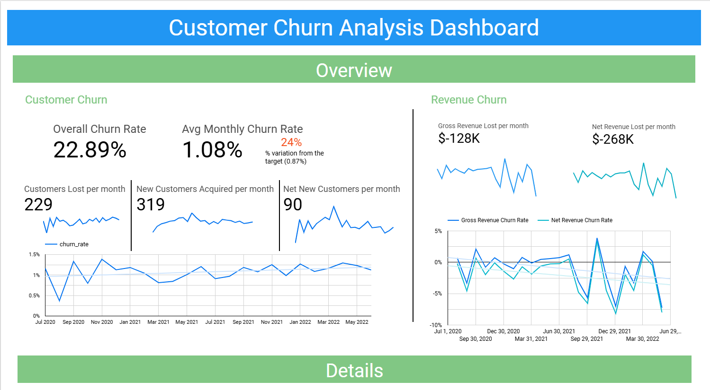

# Customer Churn Dashboard in Google Looker Studio

[View the Customer Churn Dataset on Google Sheets](https://docs.google.com/spreadsheets/d/1RsuBp4I__ySf9EJ-NcITVaI2ZvPZnKxmS3IvsySySYg/edit?usp=sharing)

## Overview

This project was built as part of a data visualization course at San Jose State University. It is an interactive dashboard analyzing customer churn metrics for a fictional telecom company. The dashboard provides insights into customer demographics, contract types, churn rates, and key factors that influence customer retention. The dashboard includes interactive filtering, breakdown dimensions, and enriched and blended data sources for complex metrics.

## Objective

To identify patterns and drivers of customer churn using descriptive analytics and visualization tools. The insights can inform strategies to improve customer retention and reduce churn rates.

## Tools & Technologies

- **Google Looker Studio** for data visualization
- **Google Sheets** for data storage and transformation
- **GitHub Pages** for project hosting

## Features

- Interactive filters for customer segment analysis  
- Key churn KPIs including tenure, contract type, and monthly charges   
- Conditional formatting to highlight high-risk customer groups

## Data

The dataset used is publicly available at https://docs.google.com/spreadsheets/d/1RsuBp4I__ySf9EJ-NcITVaI2ZvPZnKxmS3IvsySySYg/edit?usp=sharing, containing anonymized customer records with attributes related to services, demographics, and churn behavior.

## How to Use

- Visit the dashboard: [View Dashboard]([https://lookerstudio.google.com/s/your-dashboard-link](https://lookerstudio.google.com/reporting/c522d84f-1a5e-4ad7-b5c1-bee20faa15ac))
- Hover over charts for detailed tooltips and trend indicators

## Insights

- Customers on month-to-month contracts are more likely to churn  
- Electronic check payment method correlates with higher churn  
- Tenure and monthly charges are strong churn indicators
